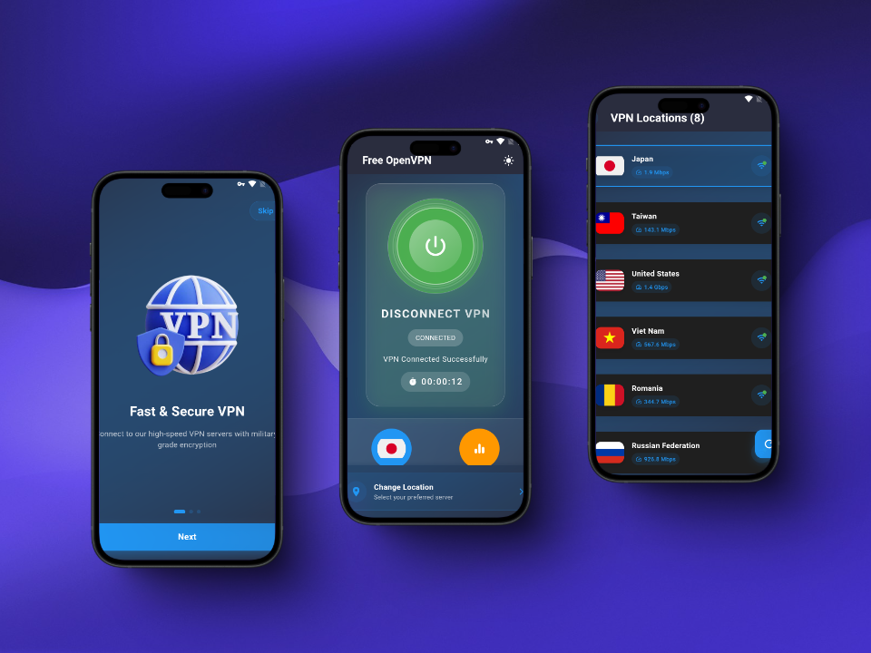
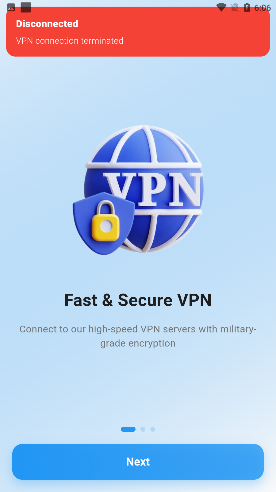

<div align="center">
  <h1>
    <br/>
    Fast VPN - Secure & Free VPN App
  </h1>
  <h3>A Modern VPN Application with Beautiful UI and Multiple Server Locations</h3>
</div>

<p align="center">
    <a href="https://github.com/jamalihassan0307/" target="_blank">
        
    </a>
    <a href="https://www.linkedin.com/in/jamalihassan0307/" target="_blank">
        
    </a>
</p>

## 📌 Overview

A beautifully designed Flutter VPN application with an elegant UI, smooth animations, and multiple free server locations. The app features a modern design, real-time network statistics, and comprehensive VPN functionality.

## 🚀 Tech Stack

- **Flutter** (UI Framework)
- **GetX** (State Management)
- **Hive** (Local Storage)
- **Custom Animations**
- **Material Design**
- **VPN Engine Integration**

## 🔑 Key Features

- ✅ **Multiple Server Locations**: Free servers across various countries
- ✅ **Real-time Network Stats**: Monitor your connection details
- ✅ **Dark/Light Theme**: Customizable app appearance
- ✅ **Network Testing**: Check connection speed and details
- ✅ **Location Selection**: Choose from various VPN servers
- ✅ **Connection Timer**: Track connection duration
- ✅ **Modern UI**: Elegant and responsive interface
- ✅ **Onboarding Screens**: Smooth introduction to the app

## 📸 Banner



## 📸 Screenshots

### Main Features

<table border="1">
  <tr>
    <td align="center">
      
      <p><b>Home Screen (Light)</b></p>
    </td>
    <td align="center">
      
      <p><b>Home Screen (Dark)</b></p>
    </td>
    <td align="center">
      
      <p><b>VPN Locations</b></p>
    </td>
  </tr>
  <tr>
    <td align="center">
      
      <p><b>Network Info (Light)</b></p>
    </td>
    <td align="center">
      
      <p><b>Network Info (Dark)</b></p>
    </td>
    <td align="center">
      
      <p><b>Status Updates</b></p>
    </td>
  </tr>
</table>

### Onboarding Experience

<table border="1">
  <tr>
    <td align="center">
      
      <p><b>Splash Screen</b></p>
    </td>
    <td align="center">
      
      <p><b>Walkthrough 1</b></p>
    </td>
    <td align="center">
      
      <p><b>Walkthrough 2</b></p>
    </td>
  </tr>
</table>

## 🌍 Available Server Locations

- 🇺🇸 United States
- 🇯🇵 Japan
- 🇰🇷 South Korea
- 🇮🇩 Indonesia
- 🇪🇨 Ecuador
- 🇷🇴 Romania
- 🇷🇺 Russia
- 🇹🇼 Taiwan
- 🇻🇳 Vietnam

## 📁 Project Structure

```
lib/
├── apis/
│   └── apis.dart
├── controllers/
│   ├── home_controller.dart
│   └── location_controller.dart
├── core/
│   └── vpn_engine.dart
├── helpers/
│   ├── pref.dart
│   └── my_dialogs.dart
├── models/
│   ├── ip_details.dart
│   ├── network_data.dart
│   └── vpn.dart
├── screens/
│   ├── home_screen.dart
│   ├── location_screen.dart
│   ├── network_test_screen.dart
│   ├── splash_screen.dart
│   └── walkthrough_screen.dart
├── widgets/
│   ├── count_down_timer.dart
│   ├── network_card.dart
│   └── vpn_card.dart
└── main.dart
```

## 📱 Download APK

You can download the latest version of the app from:
[APK/app-armeabi-v7a-release.apk](APK/app-armeabi-v7a-release.apk)

## 👨‍💻 Developer

Developed by [Jam Ali Hassan](https://github.com/jamalihassan0307)

---
